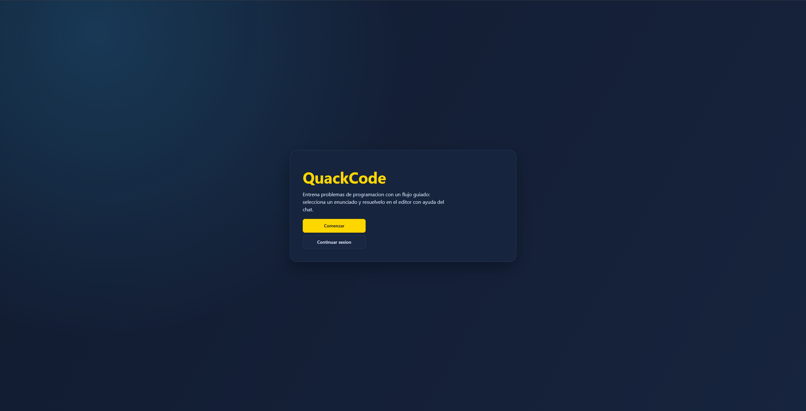
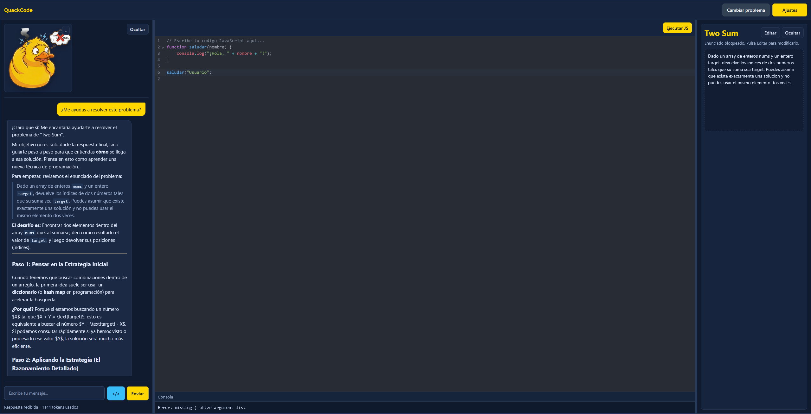

# TFG - Ayudante de aprendizaje (nombre provisional)
**Actualmente en desarrollo ...**

Aplicación web para practicar problemas de programación con tres elementos principales:
- editor de código
- chat con LLM local (LM Studio)
- ejecucion JavaScript en navegador

Esta aplicación implementa un entorno de apoyo al aprendizaje de programación basado en práctica guiada. El usuario selecciona un problema, desarrolla su solución en el editor, consulta dudas al asistente LLM local y valida su razonamiento mediante ejecución JavaScript básica.

Además, el entorno cuenta con un compañero interactivo (un **pato de goma virtual**) que reacciona a tus acciones de forma dinámica. Dependiendo de si estás pensando un problema, ejecutando código o hablando por el chat, el pato cambiará su estado y expresiones para acompañarte, haciendo la experiencia de aprendizaje (y el famoso *Rubber Duck Debugging*) mucho más amena visualmente.

### Landing



### Workspace



## Stack

- Frontend: React 19 + TypeScript + Vite
- Backend: Express + TypeScript + Zod
- Base de datos: SQLite (better-sqlite3)
- LLM local: LM Studio (API compatible OpenAI)

## Requisitos

- [Node.js](https://nodejs.org/) 20 o superior
- [LM Studio](https://lmstudio.ai/) con un modelo descargado y el servidor local activo en `http://localhost:1234`

## Instalación y ejecución
Para ejecutar el proyecto en tu máquina, sigue estos pasos:

1. Clonar el repositorio:
    ```bash
    git clone https://github.com/Mario-Grc/proyecto-tfg.git
    cd proyecto-tfg
    ```

2. Instalar dependencias del frontend:
    ```bash
    npm install
    ```

3. Instalar dependencias del backend:
    ```bash
    cd backend
    npm install
    cd ..
    ```

4. Configurar LM Studio:
    *   Descarga e instala [LM Studio](https://lmstudio.ai/).
    *   Descarga el modelo que desees utilizar dentro de LM Studio.
    *   Ve a la pestaña de "Local Server" (Servidor Local).
    *   Selecciona el modelo descargado en la parte superior de la pestaña.
    *   Inicia el servidor (Start Server). Por defecto suele correr en `http://localhost:1234`.
    *   En server settings activa la opción `enable CORS`.

5. Configurar el backend:
    Crea `backend/.env` a partir de `backend/.env.example`.
    ```bash
    cp backend/.env.example backend/.env
    ```

    Edita `backend/.env` si necesitas cambiar el puerto o la URL de LM Studio.

6. Ejecutar el backend (terminal 1):
    ```bash
    cd backend
    npm run dev
    ```

7. Ejecutar el frontend (terminal 2, desde la raiz del proyecto):
    ```bash
    npm run dev
    ```

La aplicación estará disponible en `http://localhost:5173`.
El backend estará disponible en `http://localhost:3001`.

## Autor
Mario García Abellán
